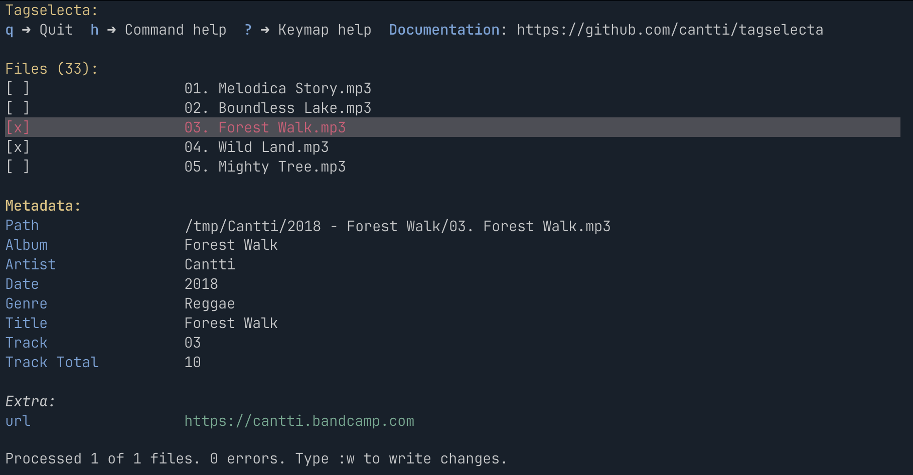

# TagSelecta



TagSelecta is a cross-platform, opinionated command-line tool for managing audio file metadata (tags).

The tool supports two modes: interactive UI (TUI) and command-line interface (CLI).

To run the TUI, simply run `tagselecta ui <path>`.

To execute commands from the CLI, run `tagselecta <command> <path>`.

`Path` can be a single file or a directory (recursive).

Some commands available only in the CLI mode: `find` to find files by metadata.

The CLI is built using [Spectre.Console](https://github.com/spectreconsole/spectre.console) for rich command-line output
and [TagLibSharp](https://github.com/mono/taglib-sharp) for tag manipulation.

## Features

- CLI and TUI modes
- `:edit` command to read and write tags
- `:move` command to move and rename files
- `:extractpicture` command to extract pictures to files
- `:titlecase` command to convert all fields to title case
- `:split` command to split artists, album artists and composers
- `:autotrack` command to automatically set track number and total tracks based on disc and disc total
- `:discogs` command to update album metadata from Discogs release
- `find` command to find files by metadata (CLI only)
- Recursive directory scanning
- Macros support
- Preview of changes before applying them
- Tree view of files
- Command history and autocompletion

## TUI vs CLI

The program is primarily designed for use in TUI mode. However, the CLI mode is particularly useful for scripting and
automating tasks.

## Install

You can install TagSelecta in one of these ways:

1. **Download release (manual):** download from GitHub Releases and place the binary in your `PATH`.
2. **Install script (automatic):** use the provided script to download and install the latest release.
3. **AUR package (Arch Linux):** install `tagselecta-bin` with an AUR helper like `yay` or `paru`.

### Option 1. Download Release (Manual Install)

1. Go to the **[Releases page](https://github.com/cantti/tagselecta/releases)**
2. Download the latest archive for your system
3. Extract it
4. Move the binary into your preferred location (for example):

```sh
mv tagselecta "$HOME/.local/bin"
```

Ensure `"$HOME/.local/bin"` is in your `PATH`.

### Option 2. Install via Script (Automatic Install)

> Tip: the same script can be used to update the installed version.

You can install the latest release automatically using the provided installer script (review the script before running
it):

```sh
wget -qO- https://raw.githubusercontent.com/cantti/tagselecta/main/install.sh | bash -s "$HOME/.local/bin"
```

This will:

* download the latest release,
* extract it,
* install it into the directory you provide (default recommended: `$HOME/.local/bin`).

### Option 3. Install from AUR (Arch Linux)

If you use Arch Linux (or an Arch-based distro), you can install the AUR package:

```sh
yay -S tagselecta-bin
```

Or with `paru`:

```sh
paru -S tagselecta-bin
```

## Getting started

Great way to get started is to use the interactive UI (TUI). Open directory with album (audio files) and run:

```sh
tagselecta ui .
```

> Important: Do not run it from the root of your music library, because it will scan all files in the directory!

Conceptually, the UI is divided into two parts: top panel with list of files and bottom panel with file details.

**Navigation**

Navigate through files using arrow keys or vim bindings (`jk`). Use `q` to exit.
Use `tab` or `space` to select file. Use `esc` to unselect.

**Edit tags**

Commands are executed using command mode (`:`). All command have the following format: `:command <option>=<value>`.
Value can be in double quotes if it contains spaces.
Exception is `:macro` (`:m`) command which has just one argument: `:macro <macro_name>`.

Try running `:edit genre=Reggae`. This will edit genre field for selected files.

No changes are applied until you _write_ them. To write changes to files use `:write` (`:w`) command.

Update multiple fields at once: `:edit genre=Reggae albumartist="King Tubby"`.

Format field values using Scriban template engine:

```sh
# Lowercase genre
:edit genre="{{ genre | string.downcase }}"

# Set artist from albumartist
:edit artist="{{ albumartist  }}"

# Set artist from albumartist
:edit artist="{{ albumartist  }}"

# Set title from filename
:edit title="{{ filename }}"
```

Other commands are implemented using the same format.

**Move files**

Very useful command is `move` (`mv`) to rename and move files.

Example:

```sh
:move template="../{{ date }} - {{ album }}/{{ pad(track) }}. {{ title }}.{{ext}}"
```

**Notes**

Most command and option have aliases. For example, `:e` is an alias for `:edit`, `:mv t=` is an alias for
`:move template=` and so on.

## CLI Usage

CLI mode is useful for scripts and quick edits.

Basic syntax:

```
USAGE:
    tagselecta [OPTIONS] <COMMAND>

EXAMPLES:
    tagselecta edit song.mp3 -t 'Song 1' -a 'Artist1;Artist 2' -k
description -v test
    tagselecta edit song.mp3 -c 'url=https://github.com'
    tagselecta edit song.mp3 -a '{{ artist | regex.replace "^VA$" "Various
Artists" "-i" }}'
    tagselecta discogs path-to-album -r
https://www.discogs.com/release/4202979-King-Tubby-Dub-From-The-Roots
    tagselecta discogs path-to-album -q King Tubby Dub From The Roots

OPTIONS:
    -h, --help       Prints help information
    -v, --version    Prints version information

COMMANDS:
    edit <path>              Edit tags (read/write). To edit extra fields, use
                             the --key key1 --value value1 options
    extractpicture <path>    Extract pictures to files
    titlecase <path>         Convert all fields to title case
    split <path>             Split artists, album artists and composers
    discogs <path>           Update album from discogs. You can pass discogs
                             release id (not master) or query to search
    autotrack <path>         Auto track
    move <path>              Move (rename) files to another directory
    find <path>              Find files by metadata
    ui <path>                Interactive UI (TUI)
```

## Read More

https://cantti.github.io/tagselecta

## Roadmap

See `ROADMAP.md` for planned improvements.
